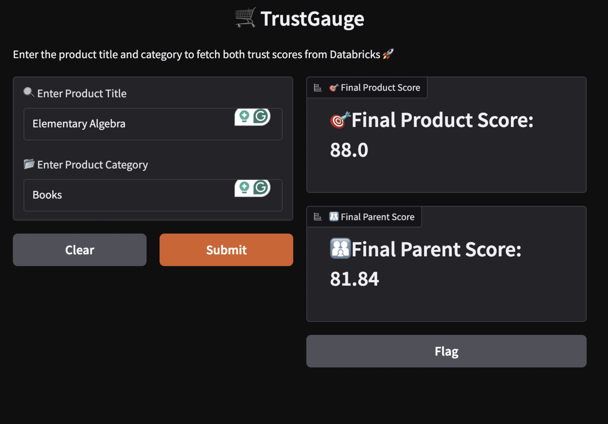

# TrustGauge : Amazon Reviews Analyzer

**TrustGauge** is a scalable pipeline that analyzes Amazon customer reviews to generate Trust Scores for products and their parent companies using NLP and big data technologies.
### Web Interface Preview


(notebooks/screenshots/UI.png)

## Overview

Star ratings don't tell the full story. TrustGauge extracts deeper sentiment insights using multilingual BERT and delivers product-level and brand-level confidence scores.

## Repository Structure

```
TrustGauge/
├── notebooks/               # Main pipeline notebook
├── src/
│   ├── data/                # ETL & cleaning scripts
│   ├── models/              # Sentiment scoring
│   ├── utils/               # Helpers
│   └── visualization/       # Plotly dashboard code
├── config/                  # AWS & Spark configs
├── tests/                   # Unit tests
└── requirements.txt         # Dependencies
```


## 🥇 Key Features
- Handles 50M+ Amazon reviews across 38 categories
- Sentiment scoring with BERT multilingual model
- Product + Company TrustScore using hybrid heuristics
- Interactive Plotly visualizations
- Cloud-native setup: AWS Glue, S3, IAM, Databricks
- Delta Lake storage with Unity Catalog

---
## 🚀 Technologies

| Layer      | Tools Used                             |
|-----------|-----------------------------------------|
| Ingestion | AWS S3, Kaggle API, GitHub Datasets     |
| Compute   | Apache Spark (Glue + Databricks)        |
| NLP       | Transformers (BERT multilingual)        |
| Viz       | Plotly, Gradio                          |
| Storage   | Delta Lake + Unity Catalog              |


## ⚙️ Getting Started
### 1. Clone + Install
```bash
cd TrustGauge
pip install -r requirements.txt
```

### 2. Configure AWS Access
- Set up IAM role (`TrustGaugeGlueAccessRole`) with `S3FullAccess`, `GlueServiceRole`
- Set up S3 bucket `trustgauge-bucket`
- Upload datasets to `datasets/` folder in the bucket

### 3. Run on AWS Glue
- Configure Glue job (Spark 3.5, Glue 5.0, 5 workers)
- Set job script to `src/main.py`

### 4. Or Use Databricks
- Mount S3 bucket
- Run `TrustGauge_Project_Code.ipynb` from `/notebooks`

---

## 📃 Dataset Details
- **Primary Source**: [Amazon US Customer Reviews](https://registry.opendata.aws/amazon-reviews/)
- **Secondary Source**: GitHub - Amazon Reviews 2023 (50GB+)

Each review includes:
- Title, Review Body, Star Rating
- Product & Category ID
- Verified Purchase, Vine, Votes

---

##  Reproducibility
To reproduce results:

1. Use notebooks/`TrustGauge_Project_Code.ipynb`
2. Ensure S3 bucket contains `*.tsv` files in `datasets/`
3. Run sections:
    - Data Acquisition & Cleaning
    - Quality Checks
    - Sentiment Inference (BERT)
    - TrustScore Aggregation
    - Delta Table Export (Unity Catalog)

---

##  Sample Visuals
- Top Product Categories by Volume
- Review Trends (Yearly + Monthly)
- Star Rating Distributions
- Verified vs Non-Verified Ratings
- Sentiment Trends by Category

> Visuals powered by Plotly + Spark Aggregations.

---

##  Final Outputs
Saved to Unity Catalog as Delta Tables:
- `review_master`
- `master_trust_score`
- `product_scores`
- `parent_scores`

Includes TrustScore per product and company.


## Outputs

| Table Name           | Description                     |
|----------------------|---------------------------------|
| review_master        | Cleaned review data             |
| product_scores       | Trust scores per product        |
| master_trust_score   | Joined with brand-level scores  |
